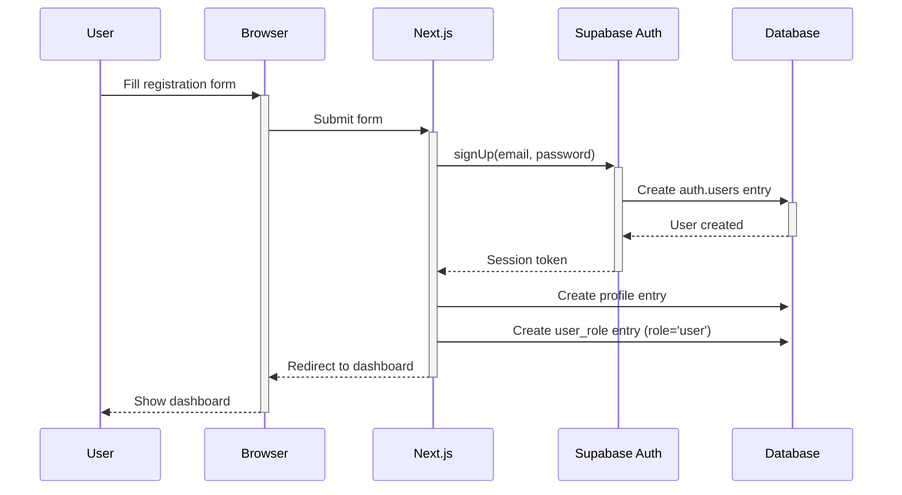
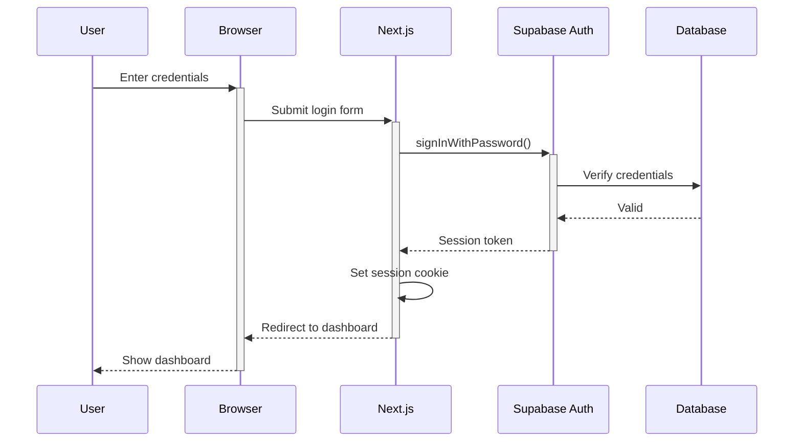

# Architecture

## System Overview

The Historical Fencing Portal uses a modern, serverless architecture optimized for SEO, performance, and free-tier hosting.

```
┌─────────────────────────────────────────────────────────────┐
│                    USER BROWSER                             │
├─────────────────────────────────────────────────────────────┤
│  React 18 + TailwindCSS                                     │
│  - Client Components (interactive UI)                       │
│  - Forms (react-hook-form + zod)                           │
│  - State Management (minimal, Zustand)                      │
└─────────────────────────────────────────────────────────────┘
                         │
                         ↓
┌─────────────────────────────────────────────────────────────┐
│              NEXT.JS 14+ APP ROUTER                         │
├─────────────────────────────────────────────────────────────┤
│  Server Components (SSR for SEO)                            │
│  ├── Public Pages: /societies, /events, /erasmus           │
│  ├── Auth Pages: /login, /register, /dashboard             │
│  └── Admin Pages: /admin/*                                 │
│                                                             │
│  Server Actions (Data Mutations)                            │
│  ├── societies/* (CRUD operations)                          │
│  ├── events/* (create, update, delete)                      │
│  ├── erasmus/* (bookings, slots)                           │
│  └── verification/* (attestations)                          │
│                                                             │
│  Middleware                                                 │
│  ├── Authentication (Supabase session)                      │
│  └── Internationalization (next-intl)                       │
│                                                             │
│  SEO Features                                               │
│  ├── Dynamic Metadata (generateMetadata)                    │
│  ├── Structured Data (JSON-LD)                             │
│  ├── Sitemap (dynamic generation)                          │
│  └── Robots.txt                                            │
└─────────────────────────────────────────────────────────────┘
                         │
                         ↓
┌─────────────────────────────────────────────────────────────┐
│                 VERCEL (Hosting)                            │
├─────────────────────────────────────────────────────────────┤
│  Edge Network (CDN)                                         │
│  - Static assets caching                                    │
│  - Image optimization                                       │
│  - Global distribution                                      │
│                                                             │
│  Serverless Functions (Node.js)                             │
│  - API routes                                               │
│  - Server Components rendering                              │
│  - Server Actions execution                                 │
└─────────────────────────────────────────────────────────────┘
                         │
                         ↓
┌─────────────────────────────────────────────────────────────┐
│                   SUPABASE                                  │
├─────────────────────────────────────────────────────────────┤
│  PostgreSQL Database                                        │
│  ├── Tables (profiles, societies, events, etc.)            │
│  ├── Row Level Security (RLS policies)                     │
│  ├── Indexes (performance + SEO)                           │
│  └── Full-text Search (GIN indexes)                        │
│                                                             │
│  Supabase Auth                                              │
│  ├── Email/Password authentication                          │
│  ├── Session management (JWT)                              │
│  └── User management                                       │
│                                                             │
│  Storage (Future)                                           │
│  └── Logo uploads, images                                  │
└─────────────────────────────────────────────────────────────┘
```

---

## Application Architecture

### Next.js App Router Structure

```
src/
├── app/
│   ├── [locale]/                    # Internationalized routes
│   │   ├── layout.tsx               # Root layout (providers, i18n)
│   │   ├── page.tsx                 # Homepage
│   │   │
│   │   ├── societies/               # Society Directory
│   │   │   ├── page.tsx             # List (SSR)
│   │   │   └── [slug]/page.tsx      # Detail (SSR, SEO)
│   │   │
│   │   ├── events/                  # Events Calendar
│   │   │   ├── page.tsx             # Calendar view (SSR)
│   │   │   ├── create/page.tsx      # Create event
│   │   │   └── [slug]/
│   │   │       ├── page.tsx         # Detail (SSR, SEO)
│   │   │       └── edit/page.tsx    # Edit event
│   │   │
│   │   ├── erasmus/                 # Erasmus Program
│   │   │   ├── page.tsx             # Landing page
│   │   │   ├── browse/page.tsx      # Browse slots (SSR)
│   │   │   └── my-bookings/page.tsx # User bookings
│   │   │
│   │   ├── dashboard/               # User Dashboard
│   │   │   ├── page.tsx             # Overview
│   │   │   ├── affiliation/page.tsx # Request affiliation
│   │   │   └── verification/page.tsx # View status
│   │   │
│   │   ├── society-admin/           # Society Manager
│   │   │   ├── members/page.tsx     # Approve affiliations
│   │   │   └── erasmus/
│   │   │       ├── settings/page.tsx
│   │   │       ├── slots/page.tsx
│   │   │       └── bookings/page.tsx
│   │   │
│   │   ├── admin/                   # Platform Admin
│   │   │   ├── events/page.tsx      # Moderate events
│   │   │   └── societies/page.tsx   # Approve managers
│   │   │
│   │   └── auth/                    # Authentication
│   │       ├── login/page.tsx
│   │       ├── register/page.tsx
│   │       └── callback/route.ts
│   │
│   ├── sitemap.ts                   # Dynamic sitemap
│   └── robots.ts                    # Robots.txt
│
├── components/                      # React Components
│   ├── ui/                          # Generic UI (shadcn/ui)
│   ├── layout/                      # Header, Footer, Nav
│   ├── societies/                   # Society components
│   ├── events/                      # Event components
│   ├── erasmus/                     # Erasmus components
│   └── verification/                # Verification components
│
├── actions/                         # Server Actions
│   ├── societies/
│   ├── events/
│   ├── erasmus/
│   ├── verification/
│   └── admin/
│
├── lib/                             # Utilities
│   ├── supabase/                    # Supabase clients
│   ├── utils/                       # Helper functions
│   ├── hooks/                       # Custom React hooks
│   └── constants/                   # Enums, constants
│
└── i18n/                            # Internationalization
    ├── routing.ts
    ├── request.ts
    └── locales/
        ├── it.json
        ├── en.json
        └── de.json
```

---

## Data Flow Patterns

### 1. Public Page (SSR for SEO)

**Example**: Event detail page `/events/[slug]`

```typescript
// app/[locale]/events/[slug]/page.tsx
export async function generateMetadata({ params }) {
  const event = await getEventBySlug(params.slug)
  return {
    title: event.title,
    description: event.description,
    // ... SEO metadata
  }
}

export default async function EventPage({ params }) {
  const event = await getEventBySlug(params.slug)
  return <EventDetail event={event} />
}
```

**Flow**:
1. User requests `/it/events/torneo-roma-2025`
2. Next.js renders Server Component on server
3. `getEventBySlug()` Server Action fetches from Supabase
4. HTML rendered with full SEO metadata
5. Page sent to browser (SSR)
6. Search engines can index immediately

---

### 2. Data Mutation (Server Action)

**Example**: Create event

```typescript
// actions/events/create-event.ts
'use server'
export async function createEvent(data: CreateEventInput) {
  // 1. Validate user authentication
  const user = await getCurrentUser()
  if (!user) throw new Error('Unauthorized')

  // 2. Validate input
  const validated = eventSchema.parse(data)

  // 3. Generate slug
  const slug = slugify(validated.title)

  // 4. Convert timezone to UTC
  const startDatetime = convertToUTC(validated.start_datetime, validated.timezone)

  // 5. Insert into database
  const supabase = createServerClient()
  const { data: event, error } = await supabase
    .from('events')
    .insert({
      ...validated,
      slug,
      start_datetime: startDatetime,
      creator_id: user.id
    })
    .select()
    .single()

  if (error) throw error

  // 6. Revalidate cache
  revalidatePath('/events')

  return event
}
```

**Flow**:
1. User submits form (Client Component)
2. Form calls `createEvent()` Server Action
3. Server Action validates, processes, saves to DB
4. Server Action returns result
5. Client Component updates UI

---

### 3. Protected Page (Role-Based Access)

**Example**: Society admin page

```typescript
// app/[locale]/society-admin/members/page.tsx
import { RoleGate } from '@/components/auth/role-gate'

export default async function SocietyMembersPage() {
  const user = await getCurrentUser()
  const society = await getUserSociety(user.id)
  const members = await getSocietyMembers(society.id)

  return (
    <RoleGate allowedRoles={['society_manager']}>
      <MembersList members={members} />
    </RoleGate>
  )
}
```

**Flow**:
1. User navigates to `/society-admin/members`
2. Middleware checks authentication
3. Server Component checks user role
4. If authorized: Render page
5. If not authorized: Show 403 or redirect

---

### 4. Internationalized Route

**Example**: Events list in different languages

```
/it/events       → Italian events page
/en/events       → English events page
/de/events       → German events page
```

```typescript
// app/[locale]/events/page.tsx
import { useTranslations } from 'next-intl'

export default async function EventsPage({ params }) {
  const t = await getTranslations('events')
  const events = await getEvents()

  return (
    <div>
      <h1>{t('title')}</h1>
      <EventsList events={events} />
    </div>
  )
}
```

**Flow**:
1. User visits `/it/events`
2. Middleware detects locale (`it`)
3. next-intl loads Italian translations
4. Server Component renders with Italian strings
5. SEO metadata in Italian
6. Hreflang tags point to `/en/events`, `/de/events`

---

## Authentication Flow

### Registration



### Login



### Session Check (Middleware)

```typescript
// middleware.ts
export async function middleware(request: NextRequest) {
  // 1. Check Supabase session
  const supabase = createMiddlewareClient(request)
  const { data: { session } } = await supabase.auth.getSession()

  // 2. Protected routes
  if (request.nextUrl.pathname.startsWith('/dashboard') && !session) {
    return NextResponse.redirect(new URL('/login', request.url))
  }

  // 3. i18n routing
  return intlMiddleware(request)
}
```

---

## State Management Strategy

### Server State (Database)

**Preferred**: Use Server Actions, no client-side cache

```typescript
// No React Query/SWR needed - Server Actions handle it
export async function EventsPage() {
  const events = await getEvents() // Server Action
  return <EventsList events={events} />
}
```

### URL State (Filters)

**Use searchParams for filter state**

```typescript
// /events?region=lazio&type=gara
export async function EventsPage({ searchParams }) {
  const events = await getEvents(searchParams)
  return <EventsList events={events} filters={searchParams} />
}
```

### Client State (UI)

**Minimal use of Zustand for UI state**

```typescript
// Only for multi-step forms, modals, etc.
const useEventFormStore = create((set) => ({
  step: 1,
  formData: {},
  nextStep: () => set((state) => ({ step: state.step + 1 }))
}))
```

---

## Security Architecture

### Row Level Security (RLS)

**Database-level access control**

```sql
-- Example: Events RLS policy
CREATE POLICY "Events are viewable by everyone"
  ON public.events
  FOR SELECT
  USING (deleted_at IS NULL AND is_published = TRUE);

CREATE POLICY "Event creator can update their event"
  ON public.events
  FOR UPDATE
  USING (creator_id = auth.uid());

CREATE POLICY "Platform admins can delete any event"
  ON public.events
  FOR DELETE
  USING (
    EXISTS (
      SELECT 1 FROM public.user_roles
      WHERE user_id = auth.uid() AND role = 'platform_admin'
    )
  );
```

### Role-Based Access Control (RBAC)

**Application-level role checks**

```typescript
// Server Component
export default async function AdminPage() {
  const user = await getCurrentUser()
  const roles = await getUserRoles(user.id)

  if (!roles.includes('platform_admin')) {
    return <Forbidden />
  }

  return <AdminDashboard />
}

// Client Component
export function AdminButton() {
  const { isAdmin } = useUserRole()

  if (!isAdmin) return null

  return <button>Delete</button>
}
```

### Input Validation

**Zod schemas for all inputs**

```typescript
const eventSchema = z.object({
  title: z.string().min(3).max(200),
  event_type: z.enum(['gara', 'sparring', 'seminario', 'allenamento_aperto']),
  start_datetime: z.date(),
  // XSS prevention: sanitize HTML in description
  description: z.string().max(5000).transform(sanitizeHtml),
})
```

---

## SEO Architecture

### Server-Side Rendering

**All public pages rendered on server**

Benefits:
- Search engines see full HTML
- Fast First Contentful Paint (FCP)
- Better Core Web Vitals
- Social media previews work

### Dynamic Metadata

```typescript
export async function generateMetadata({ params }) {
  const event = await getEventBySlug(params.slug)

  return {
    title: `${event.title} - Scherma Storica Portal`,
    description: event.description,
    openGraph: {
      title: event.title,
      description: event.description,
      images: [{ url: event.image_url }],
    },
    alternates: {
      canonical: `/it/events/${params.slug}`,
      languages: {
        'it': `/it/events/${params.slug}`,
        'en': `/en/events/${params.slug}`,
        'de': `/de/events/${params.slug}`,
      }
    }
  }
}
```

### Structured Data

```typescript
export function EventSchema({ event }) {
  const schema = {
    '@context': 'https://schema.org',
    '@type': 'Event',
    name: event.title,
    startDate: event.start_datetime,
    location: {
      '@type': 'Place',
      name: event.location_name,
      address: {
        '@type': 'PostalAddress',
        addressLocality: event.city,
        addressRegion: event.region,
      }
    }
  }

  return (
    <script
      type="application/ld+json"
      dangerouslySetInnerHTML={{ __html: JSON.stringify(schema) }}
    />
  )
}
```

### Dynamic Sitemap

```typescript
// app/sitemap.ts
export default async function sitemap() {
  const events = await getEvents({ limit: 10000 })
  const societies = await getSocieties({ limit: 10000 })

  return [
    ...events.map(event => ({
      url: `https://schermaportal.com/it/events/${event.slug}`,
      lastModified: event.updated_at,
      priority: 0.9,
    })),
    ...societies.map(society => ({
      url: `https://schermaportal.com/it/societies/${society.slug}`,
      lastModified: society.updated_at,
      priority: 0.7,
    }))
  ]
}
```

---

## Caching Strategy

### Static Pages

```typescript
// Homepage - ISR with 1 hour revalidation
export const revalidate = 3600

export default async function HomePage() {
  const upcomingEvents = await getEvents({ limit: 10 })
  return <Homepage events={upcomingEvents} />
}
```

### Dynamic Pages

```typescript
// Event detail - On-demand revalidation
export default async function EventPage({ params }) {
  const event = await getEventBySlug(params.slug)
  return <EventDetail event={event} />
}

// Revalidate when event updated
export async function updateEvent(id, data) {
  await supabase.from('events').update(data).eq('id', id)
  revalidatePath(`/events/${event.slug}`)
}
```

### API Response Caching

```typescript
// React cache for request deduplication
import { cache } from 'react'

export const getEvent = cache(async (id: string) => {
  const { data } = await supabase
    .from('events')
    .select('*')
    .eq('id', id)
    .single()
  return data
})
```

---

## Error Handling

### Server Actions

```typescript
export async function createEvent(data) {
  try {
    const validated = eventSchema.parse(data)
    const result = await supabase.from('events').insert(validated)

    if (result.error) {
      return { error: result.error.message }
    }

    return { success: true, data: result.data }
  } catch (error) {
    if (error instanceof z.ZodError) {
      return { error: 'Validation failed', details: error.errors }
    }
    return { error: 'An unexpected error occurred' }
  }
}
```

### Error Boundaries

```typescript
// app/[locale]/error.tsx
export default function Error({ error, reset }) {
  return (
    <div>
      <h2>Something went wrong!</h2>
      <button onClick={reset}>Try again</button>
    </div>
  )
}
```

---

## Performance Optimizations

### Image Optimization

```typescript
import Image from 'next/image'

<Image
  src={society.logo_url}
  alt={society.name}
  width={200}
  height={200}
  loading="lazy"
  placeholder="blur"
/>
```

### Code Splitting

```typescript
// Lazy load heavy components
const CalendarView = dynamic(() => import('@/components/calendar-view'), {
  loading: () => <CalendarSkeleton />
})
```

### Database Query Optimization

```typescript
// Use indexes for common queries
CREATE INDEX idx_events_start_datetime ON events(start_datetime DESC)
  WHERE deleted_at IS NULL;

// Pagination for large lists
const events = await supabase
  .from('events')
  .select('*')
  .range(offset, offset + limit)
```

---

## Deployment Architecture

### Vercel Deployment

```
GitHub Repository
     │
     │ (git push)
     ↓
Vercel Build
     │
     ├── Build Next.js app
     ├── Optimize images
     ├── Generate static pages
     └── Deploy serverless functions
     │
     ↓
Vercel Edge Network (CDN)
     │
     ├── North America
     ├── Europe
     └── Asia Pacific
```

### Environment Variables

```bash
# .env.local
NEXT_PUBLIC_SUPABASE_URL=https://xxx.supabase.co
NEXT_PUBLIC_SUPABASE_ANON_KEY=xxx
SUPABASE_SERVICE_ROLE_KEY=xxx (server-only)
NEXT_PUBLIC_SITE_URL=https://schermaportal.com
```

---

## Monitoring & Observability

### Built-in Metrics

- **Vercel Analytics**: Page views, performance metrics
- **Supabase Dashboard**: Database queries, storage usage
- **Next.js DevTools**: Build analysis, bundle size

### Error Tracking (Future)

- **Sentry** (optional): Real-time error monitoring
- **LogRocket** (optional): Session replay

---

## Scalability Considerations

### Database

**Current**: Single PostgreSQL instance (Supabase)

**Future scaling**:
- Read replicas for heavy read operations
- Connection pooling (Supabase built-in)
- Partitioning for large tables (events by year)

### Application

**Current**: Serverless functions (Vercel)

**Auto-scaling**:
- Vercel automatically scales based on traffic
- No manual intervention needed
- Pay-per-use model (but free tier for MVP)

### CDN

**Current**: Vercel Edge Network

**Benefits**:
- Global distribution
- Automatic caching
- DDoS protection

---

## Disaster Recovery

### Database Backups

**Supabase**:
- Daily automatic backups (retained 7 days)
- Point-in-time recovery
- Export database manually for long-term backup

### Code Versioning

**Git**:
- All code in GitHub
- Tagged releases
- Branch protection rules

### Rollback Strategy

**Vercel**:
- One-click rollback to previous deployment
- Keep last 100 deployments
- Preview deployments for testing

---

## Summary

The architecture prioritizes:

1. **SEO**: SSR for all public pages, dynamic metadata, structured data
2. **Performance**: Edge CDN, image optimization, efficient queries
3. **Security**: RLS policies, RBAC, input validation
4. **Scalability**: Serverless auto-scaling, free tier sustainability
5. **Developer Experience**: Modern stack, type safety, clear patterns
6. **Maintainability**: Well-organized code, clear separation of concerns

The system is designed to start small (free tier) and scale as needed without architectural changes.
